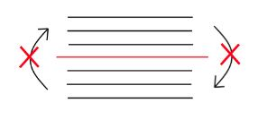
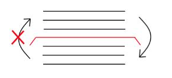
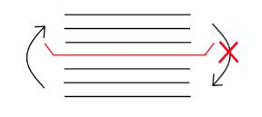

## Instructions reordering

| Instructions types | C#  					| x86 					| C# volatile 			|
| ------------------ | --- 					| --- 					| ----------- 			|
| LoadStore          | :heavy_check_mark:   | :x:   				| :x:           		|
| LoadLoad           | :heavy_check_mark:   | :x:   				| :x:           		|
| StoreStore         | :x:   				| :x:					| :x:           		|
| StoreLoad          | :heavy_check_mark:   | :heavy_check_mark:   	| :heavy_check_mark:   	|

## Fencing
### Full fence
```Csharp
public void Method()
{
  ... instruction ...
  ... instruction ...
  ... instruction ...
  Thread.MemoryBarrier(); -----------------
  ... instruction ...
  ... instruction ...
  ... instruction ...
}
```

### Half fence : Read fence
Volatile read = acquire fence (half fence)

> :bulb: **ARF = Acquire Read Follow**

```Csharp
private volatile int _value;

public void Method()
{
  ... instruction ...
  ... instruction ...
  ... instruction ...
  if (_value) -----------------
  {
    ...
  }
  ... instruction ...
  ... instruction ...
  ... instruction ...
}
```

### Half fence : write fence
Volatile write = release fence (half fence)
```Csharp
private volatile int _value;

public void Method()
{
  ... instruction ...
  ... instruction ...
  ... instruction ...
  _value = 1;  -----------------
  ... instruction ...
  ... instruction ...
  ... instruction ...
}
```
